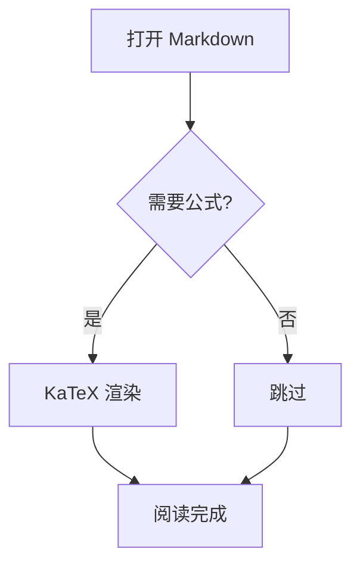
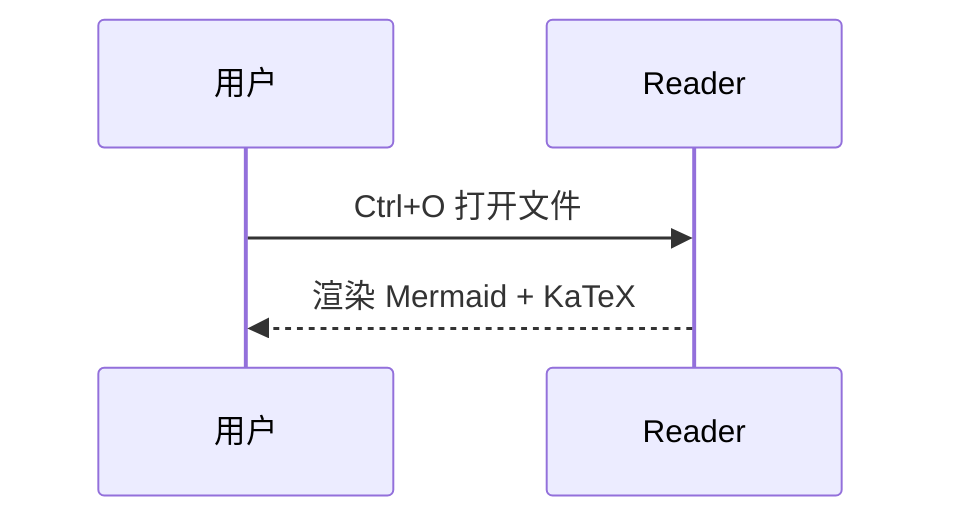

# Mermaid 与 KaTeX 测试

## 数学公式

行内公式 $E = mc^2$ 与欧拉恒等式 $e^{i\pi} + 1 = 0$。

块级公式：

$$
\int_{-\infty}^{\infty} e^{-x^2} \, dx = \sqrt{\pi}
$$

## 流程图

```mermaid
graph TD
    A[打开 Markdown] --> B{需要公式?}
    B -->|是| C[KaTeX 渲染]
    B -->|否| D[跳过]
    C --> E[阅读完成]
    D --> E
```

## 时序图

```mermaid
sequenceDiagram
    participant U as 用户
    participant R as Reader
    U->>R: Ctrl+O 打开文件
    R-->>U: 渲染 Mermaid + KaTeX
```
